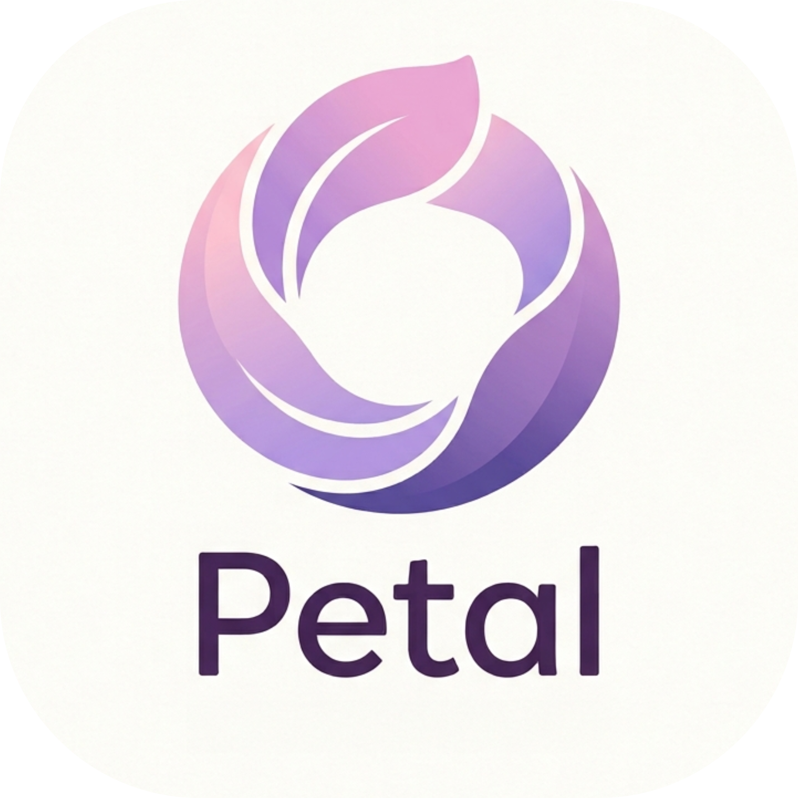

<div align="center">



# Petal

**Your cycle, gently tracked — private, offline, and beautifully simple.**

[](https://github.com/3th4n-J/petal-app/releases/latest)
[](https://github.com/3th4n-J/petal-app/releases)
[](https://flet.dev)
[](https://www.python.org)
[](#-privacy)

<em>Track your cycle with calm, clarity, and care.</em>

</div>

---

## ✨ Overview

**Petal** is a private, offline-first period and cycle tracker. Log your periods, symptoms and moods, and see your current phase, fertile window and next-period prediction at a glance — wrapped in a soft, Flo-inspired design with six pastel themes.

No accounts. No servers. No tracking. Your data lives on your device.

> 🌸 Built with care to be a calm, everyday companion.

---

## 📸 Screenshots

<div align="center">

| Today | Calendar | Insights | Log period |
|:---:|:---:|:---:|:---:|
|  |  |  |  |

</div>

---

## 🚀 Features

### 🌸 Today at a Glance
- **Cycle ring** — current cycle day with a live *"period in N days"* countdown.
- **Personal greeting** — a casual, time-of-day hello that reads your profile name.
- **Phase & fertility card** — current phase chip plus ovulation, fertile window and next-period dates.
- **Current phase card** — Menstrual / Follicular / Ovulation / Luteal, with a rotating **hormone fun-fact** (FSH, estrogen, LH, progesterone).
- **Quick stats** — average cycle length, average period length, cycles logged.

### 📅 Calendar
- Month grid with colour-coded dots: **logged period**, **predicted period**, **fertile window** and **ovulation**.
- Month-to-month navigation and a clear legend.

### 📈 Insights
- Averages and totals at a glance, plus your full, **editable history**.

### 📝 Logging
- Log **start/end dates**, **flow**, **mood**, **symptoms** (themed chips) and **notes**.
- Edit or delete any entry; predictions, phases and the fertile window are all **derived automatically**.

### 🗑️ Trash (30-day retention)
- Deleting an entry moves it to **Trash** (with a confirmation) — restore it or delete it forever.
- Auto-purged after 30 days.

### 🎨 Theming
- **Six pastel palettes** — Lavender, Coral, Teal, Baby blue, Storm and Pale.
- Themes re-tint everything: primary colour, gradients, the gradient **+** button, nav highlight and fields.

### 📱 Responsive & Animated
- **Mobile-first scaling** — text, icons and controls scale with the viewport (phones → tablets) and re-flow on resize.
- Cross-fading nav highlight, smooth screen transitions, and a docked gradient action button.

### 🔒 Private & Secure
- **PIN app-lock** — set a PIN and Petal shows a lock screen on launch. PINs are **salted + SHA-256 hashed**, never stored in plaintext.
- **Local-first** — all data stays on-device.

### 🔄 Up to Date
- **In-app update checker** — checks the GitHub repo for a newer release and offers a one-tap **Update** button that opens the download page.

---

## 🛠️ Tech Stack

| | |
|---|---|
| **Language** | Python 3.13 |
| **UI** | [Flet](https://flet.dev) 0.85 (Flutter under the hood) |
| **Storage** | SQLite — `period_tracker.db` (entries + settings) |
| **Networking** | httpx (update check only) |
| **Tooling** | [uv](https://github.com/astral-sh/uv) for env & builds |
| **Packaging** | `src/` layout + Hatchling |

---

## 🏁 Getting Started (development)

```bash
# 1. Install uv (https://github.com/astral-sh/uv), then sync deps
uv sync

# 2. Run on desktop for quick iteration
uv run flet run main.py

# 3. Optional: load a few sample cycles
uv run python -m petal.seed

# 4. Build a signed Android APK (see Release workflow below)
uv run flet build apk
```

> **Note:** runtime deps stay lean — only `flet` is bundled into the APK. The Flet CLI, web/desktop server and the `websockets` fix live in the `dev` dependency group (installed by uv, never shipped to the device).

---

## 📦 Release Workflow

Two helper scripts (`build-release.ps1` is git-ignored — it holds the keystore path) make releases a two-step affair:

```powershell
# Build a signed APK — prompts for the keystore password, auto-increments versionCode
.\build-release.ps1

# Commit, tag (vX.Y.Z), push, and publish the GitHub release
.\create-release.ps1            # prompts once for a message used as commit + release notes
.\create-release.ps1 -Build     # chain both: build then release
```

Signing uses a local release keystore (`petal-release.jks`, git-ignored). Releases are published to the app repo, where the in-app update checker looks for them.

📥 **Download the latest APK:** [github.com/3th4n-J/petal-app/releases](https://github.com/3th4n-J/petal-app/releases)

---

## 🗂️ Project Structure

```
PT/
├─ main.py                 # entry point for `flet run` / `flet build`
├─ pyproject.toml          # uv project (runtime: flet · dev: flet[all] + websockets)
├─ assets/
│  └─ icon.png             # app / launcher icon
└─ src/petal/
   ├─ __init__.py          # version
   ├─ __main__.py          # `python -m petal` / `uv run petal`
   ├─ models.py            # PeriodEntry dataclass + option lists
   ├─ db.py                # SQLite data layer (CRUD, settings, trash, PIN)
   ├─ cycle_stats.py       # predictions, phases, fertile window, calendar map
   ├─ theme.py             # 6 pastel palettes, responsive scaling, cards/pills
   ├─ widgets.py           # canvas cycle ring, stat tiles, calendar grid
   ├─ ui.py                # nav shell + Today/Calendar/Insights/Settings + lock + updates
   └─ seed.py              # sample data loader
```

---

## 🔐 Privacy

Petal is **offline-first and account-free**. Your entries, symptoms and settings never leave your device. The only network request is an optional check to GitHub for app updates.

---

## 🙏 Author

Made with love by **Ethan Johnston**.

> Built for my angel ❤️ — may it be a small, gentle help every day.

---

<div align="center">
<sub>© 2026 Ethan Johnston · Petal</sub>
</div>
